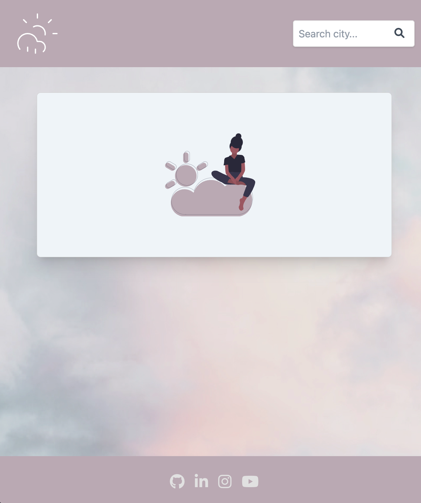
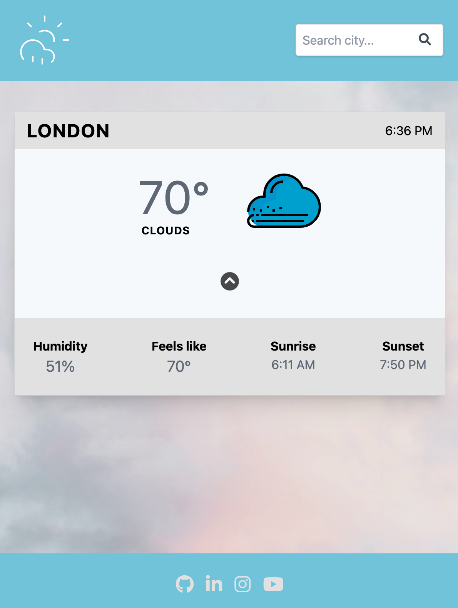

# weather-app

## Project Name & Pitch

Rain or Shine [Visit the weather app](https://oswhytecodes-weatherapp.netlify.app/)

A lite Weather App using [The Open Weather Map API](https://openweathermap.org/)

Enter your city in the search bar, the APi will send back the temparature, weather conditions and local time.

There is also a "see more" feature that shows additional details like sunset/sunrise time.

Built with Vite, React, Typescript, Redux and Tailwind

The API is being called with NodeJS and Express

Project was inspired by Konstantin Münster via a Medium article on organizing a React project

The [article](https://konstantinmuenster.medium.com/how-to-plan-and-organize-a-react-project-by-building-a-weather-app-95175b11bd01) gives an overview
of how to plan a React project. How to organize your components with the folder structure

## Project Status

Sept 1. 2022
Successfully launched the  app, the backend works with the front end :))
Currently working on building
 - "night time" feature where the UI gets dark based on the time of the city
 - a current location feature that will require a second API call
 
## Project Screen Shot(s)





## Installation and Setup Instructions

Clone down this repository. You will need `node` and `npm` installed globally on your machine.

Installation:

## Clone Project

```
gh repo clone oswhytecodes/weather-app

```

```
npm install

```

To Start Server:

```

npm run dev

```

To Visit App:

```

localhost:3000/

```

## Reflection

- What was the context for this project?

  This was a side project to practice the features in a small frontend project.

  Using Redux to hold the state, and NodeJS to hide the API key and call the weather API

- What did you set out to build?

  I set out to build a simple weather app to showcase my design and programmingn skills.

- Why was this project challenging and therefore a really good learning experience?

  The weather app was challenging as I am know to Typescript, Redux, NodeJS and hosting the backend.

  Learning about epoch and utc time and converting these numbers to the local time of the cities searched.

- What were some unexpected obstacles?

  I never ever imagined working with NodeJS and hosting a backend server. I am still in awe of the amount of work I put into building this project out.

- What tools did you use to implement this project?

  The React App was built with Vite, installed Tailwind, Typescript, Redux, DateFormat, Axios, Node JS, Express, cors etc
